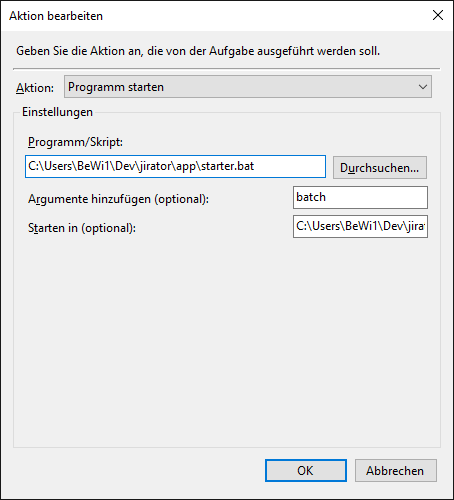

Usage
#####

JIRA credentials
****************

When running the script for the first time you will be prompted to enter your JIRA credentials.
The credentials are stored for future use in the ``auth.pickle`` file.
If you need to re-enter your credentials in case of a password reset, simply delete that file and re-run the script in any mode.

.. code-block:: console

	(.venv) C:\Users\BeWi1\Dev\jirator\app>jirator.py batch
	Please enter username: 
	Please enter password: 

``filter`` mode
***************

In ``filter`` mode the app will take the JIRA JQL query with the given name defined in ``config.json`` and export/import any issues found with this filters.

.. code-block:: console

	(.venv) C:\Users\BeWi1\Dev\jirator\app>jirator.py filter -f TFA_Tickets
	10:24:03.457 | INFO     | __main__:get_build_info:31 - jirator Build 57 (2020-09-07T15:04:47.153291)
	10:24:03.461 | INFO     | auth_helper:load:26 - Using credentials from auth file
	10:24:03.462 | INFO     | jiraconnector:connect:41 - Connecting to JIRA at https://asc.bmw.com/jira
	10:24:04.567 | INFO     | jiraconnector:get_issues_from_filter:101 - Getting JIRA issues for filter 'project = "Automatisierung Prüffeld E-Antrieb" AND (summary ~ TFA OR summary ~ Lala OR summary ~ lala OR summary ~ hvl) AND (labels in (MF) OR component in (MF)) AND updated > -2d'
	10:24:09.700 | SUCCESS  | jiraconnector:get_issues_from_filter:121 - Got 31 JIRA issues
	10:24:09.705 | INFO     | jiraconnector:prepare_data_for_export:137 - Preparing for export 1 / 31: CCB-4224
	10:24:09.758 | INFO     | jiraconnector:prepare_data_for_export:137 - Preparing for export 2 / 31: CCB-6851
	10:24:09.808 | INFO     | jiraconnector:prepare_data_for_export:137 - Preparing for export 3 / 31: CCB-2151
	[..]
	10:24:10.843 | INFO     | jiraconnector:prepare_data_for_export:137 - Preparing for export 29 / 31: CCB-933
	10:24:10.886 | INFO     | jiraconnector:prepare_data_for_export:137 - Preparing for export 30 / 31: CCB-7976
	10:24:10.924 | INFO     | jiraconnector:prepare_data_for_export:137 - Preparing for export 31 / 31: CCB-7894

``batch`` mode
**************

In ``batch`` mode the app will go through all JIRA JQL queries defined in ``config.json`` and export/import any issues found with those filters.

``query`` mode
**************

In ``query`` mode you can give a JIRA JQL query which the script will then use for export/import.
	
.. code-block:: console	
	
	(.venv) C:\Users\BeWi1\Dev\jirator\app>jirator.py query -f "key in (CCB-4224, CCB-6851)"
	10:28:46.857 | INFO     | jirator Build 57 (2020-09-07T15:04:47.153291)
	10:28:46.860 | INFO     | Using credentials from auth file
	10:28:46.862 | INFO     | Connecting to JIRA at https://asc.bmw.com/jira
	10:28:47.793 | INFO     | Getting JIRA issues for filter 'key in (CCB-4224, CCB-6851)'
	10:28:48.580 | SUCCESS  | Got 2 JIRA issues
	10:28:48.582 | INFO     | Preparing for export 1 / 2: CCB-6851
	10:28:48.624 | INFO     | Preparing for export 2 / 2: CCB-4224

Schedule
********

Using cron
----------

When running Linux (e.g. on an Raspberry Pi) you can use *cron* to schedule the execution of the script. Open *crontab* like this:

.. code-block:: console	
	
	[bewi1@desktop ~]$ crontab -e

Add a new line with the following content to executed the script every 30 minutes:

.. code-block::
	
	*/30 * * * * cd ~/jirator && python3 jirator.py batch >/dev/null 2>&1

Using task scheduler
--------------------

Create a new task within the task scheduler. Configure the triggers to your preferences. Configure actions like shown here:

